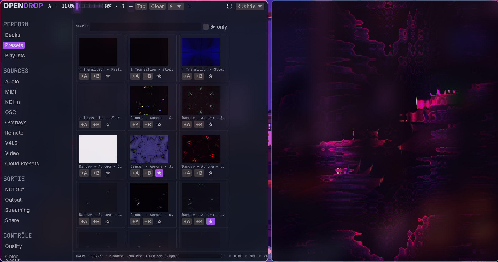
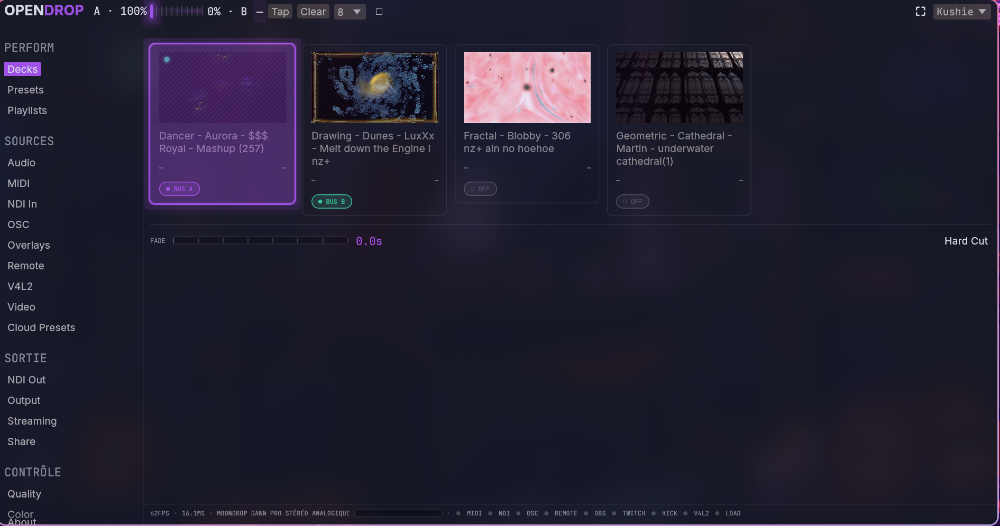
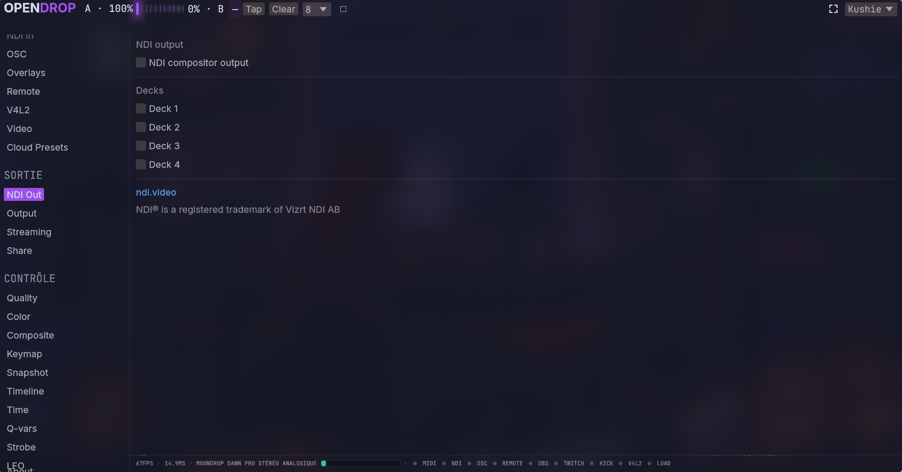
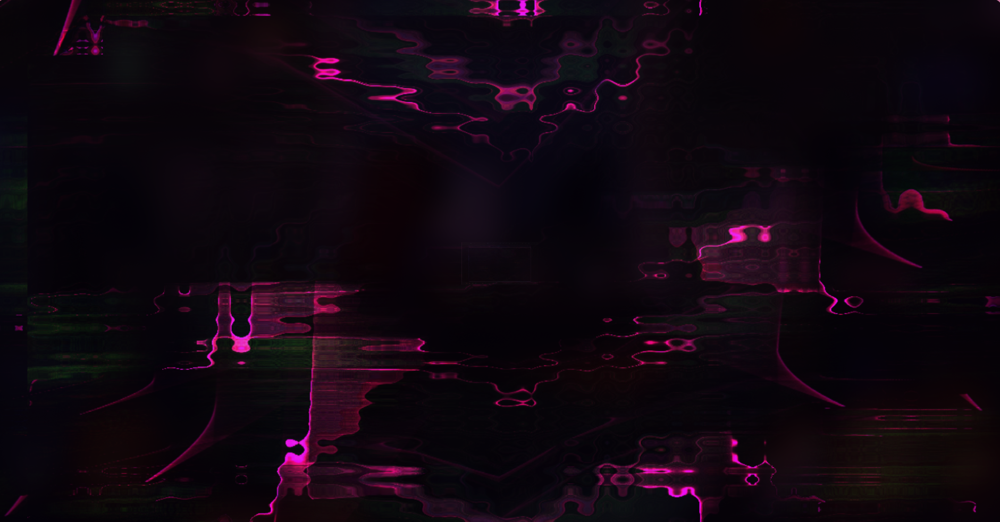

<div align="center">


# OpenDrop VJ

</div>

A 4-deck Milkdrop VJ instrument built on [libprojectM](https://github.com/projectM-visualizer/projectm): GPU compositor, MIDI/OSC/Ableton Link control, NDI in/out, and a phone remote control, packaged as a native Rust/egui desktop app.

This is the native rewrite. The previous Electron/SvelteKit web app lives on the `legacy-web` branch.

## Features

- 4 decks with crossfader, playlists, snapshots, and a preset browser backed by libprojectM
- Beat detection, per-slot LFO, and beat-triggered modulation
- Live Time/Q-var parameter injection into the running preset
- Compositor: blend modes, luma/color keying, text and sprite overlays, strobe
- Control surfaces: MIDI (learn-based mapping), OSC, a phone remote control served over WebSocket, and optional Ableton Link
- Output: NDI in/out, v4l2loopback, OBS WebSocket scene control, Twitch/Kick chat
- Cloud presets and shareable set links
- Local video clip playback and camera capture via `ffmpeg`

## Screenshots









## Building

```sh
cargo build --workspace
```

### NDI SDK (build-time dependency)

Building this workspace, including just the `io` or `app` crate (`app` depends on `io`), needs the NDI SDK (headers + libs) present at build time, not only at runtime: `grafton-ndi` uses `bindgen` in its `build.rs`, which makes it a real build dependency rather than a runtime `dlopen`.

Two versioned files bridge this machine's Arch packaging: `ndi-sdk-shim/` (symlinks under `include`/`lib/x86_64-linux-gnu` to the pacman `ndi-sdk` package's system locations) and `.cargo/config.toml` (points `NDI_SDK_DIR` at `ndi-sdk-shim` when the shell doesn't already export it). See the comment at the top of `.cargo/config.toml` for the full workaround.

On another machine or SDK layout (the standard NewTek installer, a different distro): either export your own `NDI_SDK_DIR` before building, or replace/remove `ndi-sdk-shim/` and the `[env]` entry in `.cargo/config.toml` accordingly. The SDK itself is available from ndi.video.

This requirement (NDI SDK plus a `libprojectm` dev package) applies to every build machine, Windows included; see `packaging/windows/README.md` for the platform-specific setup there.

### Known limitation: NDI discovery

NDI network discovery (enumerating NDI sources published on the local network in the UI) depends on an Avahi daemon running on the host. The distributed AppImage can't bundle a system daemon, so this limitation is accepted rather than worked around. The app runs normally without it; automatic NDI source discovery just won't be available, while direct access by URL or IP address still works.

### Ableton Link (optional, GPL)

Ableton Link support (`io::link` / the Link panel) is disabled by default: it's neither compiled nor linked into the binary produced by a standard `cargo build`.

Reason: this support is built on `rusty_link`, a Rust binding to Ableton's official C++ Link library, distributed under **GPL-2.0-or-later**. Unlike LGPL, GPL has no permissive dynamic-linking clause, so linking `rusty_link`, static or dynamic, puts the whole resulting binary under GPL-2.0-or-later.

To enable it explicitly:

```sh
cargo build --features opendrop-app/link
```

(`opendrop-app` is the binary crate's package name, declared in `app/Cargo.toml`, not its directory name `app/`.)

A binary built with this feature must be treated as **GPL-2.0-or-later as a whole**, not under this project's default license. It must stay out of any binary packaged or distributed by default; the `link` feature is for local/optional builds that knowingly accept that license contamination.

### `ffmpeg` (runtime dependency)

Two features shell out to `ffmpeg`, which must be on `PATH` at runtime (nothing links against it at build time):

- **v4l2loopback output** (`io::v4l2loopback`): the compositor writes its RGBA frames into a v4l2loopback device.
- **Video panel** (`io::video_capture`): local clip decoding and camera capture, in the other direction: `ffmpeg` writes raw RGBA frames to its stdout, and the app uploads them as a GL texture.

Without `ffmpeg`, both panels show an error and the rest of the app runs normally. Video clips themselves aren't bundled; see `app/assets/video-loops/README.md`.

### Native file dialog (`rfd`)

The CloudPresets (`ui::cloud_presets`, Upload button) and Video (`ui::video`, "+ Video" button) panels use `rfd` for a native file picker. On Linux, `rfd`'s default backend (features `xdg-portal` + `async-std`, not `gtk3`) goes through xdg-desktop-portal via D-Bus (`ashpd`), so no GTK3 library is needed at build or link time. At runtime, this backend does need an `xdg-desktop-portal` service (plus a portal implementation, e.g. `xdg-desktop-portal-gtk`/`-kde`/`-hyprland`) running in the session; without it, the Upload button silently fails to open a picker rather than failing the build.

## Packaging

- Linux: AppImage, via `packaging/appimage/build-appimage.sh`.
- Windows: portable zip, via `packaging/windows/build-portable.ps1`. See `packaging/windows/README.md` for the vcpkg/projectM setup this depends on.

## License

MIT, except the optional `link` feature above, which is GPL-2.0-or-later when enabled.
