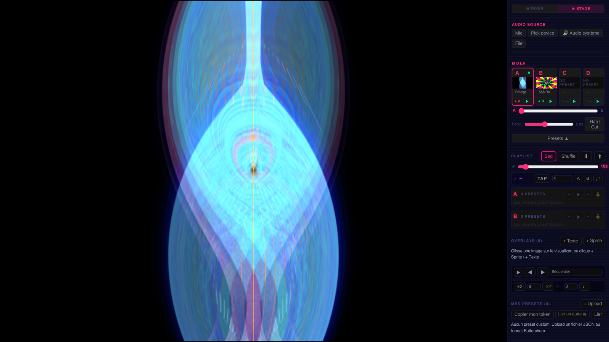
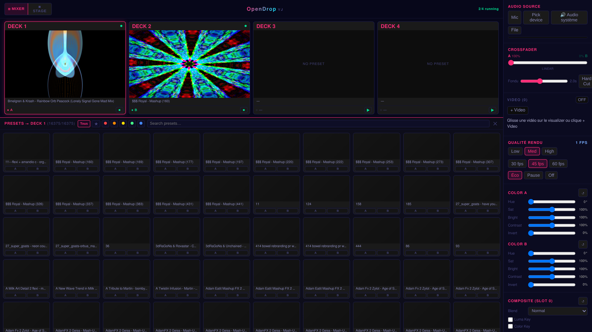
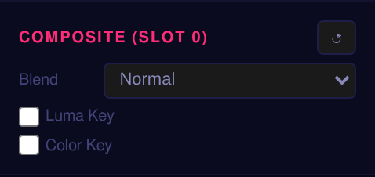
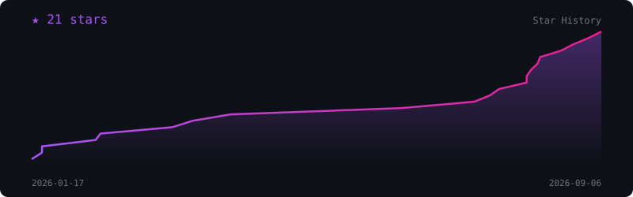

<div align="center">


# OpenDrop VJ

### A 4-deck Milkdrop VJ instrument: GPU compositor, MIDI · OSC · Ableton Link, NDI · Spout · virtual-cam output. Web-first, Electron-powered.

[](https://opendrop.kushie.dev)
[](https://github.com/kushiemoon-dev/OpenDrop-VJ/releases)
[](https://github.com/kushiemoon-dev/OpenDrop-VJ/stargazers)
[](LICENSE)


</div>

---

## Overview

**OpenDrop VJ** is a live visual instrument built on [Butterchurn](https://github.com/jberg/butterchurn) (a WebGL port of the Milkdrop engine). Four independent decks (each assignable to bus A, B, or off) mix through a single live crossfader, and a GPU compositor layers, blends, and chroma-keys them on top of each other in real time. Started as a 2-deck web toy, it has grown into a full VJ rig: 16,375 presets, snapshot/timeline automation, per-deck parameter editing, MIDI/OSC/Ableton Link control surfaces, and professional outputs (NDI, Spout, a Linux virtual webcam). It runs in any browser with no install, or as an Electron desktop app that unlocks the native I/O.

---

## Features

**Mixing & decks**

- **4 independent Butterchurn decks**, each routed to bus A, B, or off, mixed through one live A↔B crossfader
- **Per-deck playlists**: auto-cycle sequential/shuffle, 2–120 s interval, prev/next
- **Beat / volume-peak trigger** per deck: auto-advance the playlist on the beat or on a volume peak
- **Q-var live editing**: override a preset's own internal q1–q32 variables per deck in real time (NestDrop-style)
- **Time param sliders**: per-deck speed/zoom/rotation/warp engine multipliers layered on top of any preset

**GPU compositor & overlays**

- **4 blend modes** (normal / additive / screen / multiply) + per-layer **LumaKey** and **ColorKey** chroma keying, all GPU-side
- **Text and media overlays**: image/video sprites or text layers, with transform, blend mode, beat-reactive scaling, spin, and drift
- **Overlay auto-cycling queue**: sequential or shuffled rotation through a set of overlays

**Automation & performance state**

- **Snapshots / macros**: 8 slots capturing and recalling a full "look" (color + compositing) with smooth interpolation
- **Timeline / keyframes**: sequence the 8 snapshot slots on a looping wall-clock timeline
- **LFO×4** (sine / saw / square / sample-and-hold), routable to any control, plus a strobe effect
- **Share a set via URL**: encode the current visual state into a link; the recipient gets a one-click import

**Presets & video**

- **16,375 built-in presets**: search, 5-color favorites, cached lazy-rendered thumbnails
- **Import your own `.milk`/`.prjm` presets**: drag one onto the visualizer to convert and load it on the fly
- **Presets cloud**: a private per-device library for your own custom presets, backed by a small Cloudflare Worker + R2 (no account, just a portable token)
- **Video loops**: beat-reactive flash/hue/scale, with an optional CDN-backed library
- **Live video layer**: webcam, or an **NDI** source received over the LAN _(NDI receive, Electron)_, as an alternative to a video loop clip

**Control surfaces**

- **MIDI**: CC/note/pitchbend mapping (14-bit CC support) with **bidirectional LED feedback** to your controller
- **OSC** input over UDP _(Electron)_
- **Ableton Link** tempo sync _(Electron)_
- **Remote control from a phone or tablet** over LAN, token-authenticated _(Electron)_
- Fully **customizable keymap**

**Streaming integrations** _(Electron)_

- **OBS WebSocket** bidirectional scene link: map each OBS scene to a deck slot or a color-coded "mood", kept in sync both ways
- **Twitch + Kick chat-poll voting**: connect your channel's chat as a live preset-vote source; a timed poll resolves and cuts to the winning preset (vote pool configurable: favorites, playlist A, or playlist B)
- Streaming credentials (OBS password, Twitch OAuth token, Kick session credentials) stored via Electron's `safeStorage`, never in plaintext

**Output & capture**

- **Output window**: detached fullscreen canvas for a second monitor or an OBS Browser Source
- **NDI** output _(Electron, requires the NDI SDK)_
- **Spout** output _(Electron, Windows only)_
- **Virtual webcam** via v4l2loopback _(Electron, Linux only)_
- **Multi-display targeting** and adjustable quality tiers (with an "invisible mode" perf mode for when the output isn't on screen)

---

## Screenshots

<div align="center">

| Stage layout                           | Mixer layout                           |
| -------------------------------------- | -------------------------------------- |
|  |  |

| GPU compositor & keying                          |
| ------------------------------------------------ |
|  |

</div>

---

## Try it

**→ [opendrop.kushie.dev](https://opendrop.kushie.dev)**: no install required (Chrome / Edge recommended).

---

## Quick Start (self-hosted)

```bash
pnpm install
pnpm dev          # → http://localhost:1420
```

Click **▶ Start** to initialize the audio context, then pick a preset in the browser panel.

---

## Desktop App (Electron)

Download the latest build for your platform from the [Releases](https://github.com/kushiemoon-dev/OpenDrop-VJ/releases) page:
Windows (`.exe`), macOS (`.dmg`, Intel and Apple Silicon), and Linux (`.AppImage`), or build from source:

```bash
pnpm electron:dev     # Vite dev + Electron in parallel
pnpm electron:build   # Build SPA → package with electron-builder
```

Native modules (NDI, Spout, Ableton Link) need a one-time rebuild against Electron's Node ABI:

```bash
pnpm electron:rebuild        # grandiose (NDI)
pnpm electron:rebuild:spout  # Windows only
pnpm electron:rebuild:link   # Ableton Link
```

**Linux / Wayland (Hyprland etc.)**: pass flags when launching the packaged app:

```bash
./OpenDrop-VJ.AppImage --ozone-platform=wayland --no-sandbox
```

---

## System Audio Capture

Click the audio source button in the app; behaviour adapts per platform:

| Platform    | Web                                                       | Electron                                                                           |
| ----------- | --------------------------------------------------------- | ---------------------------------------------------------------------------------- |
| **Windows** | Screen picker → "Share system audio" (Chrome)             | Native loopback, no picker                                                        |
| **Linux**   | Device picker → `.monitor` source (PipeWire / PulseAudio) | Same                                                                               |
| **macOS**   | Tab audio only                                            | Install [BlackHole](https://github.com/ExistentialAudio/BlackHole) → device picker |

**Linux tip:** `bash scripts/setup-audio.sh` creates a named PipeWire virtual source ("OpenDrop - Son du PC")
instead of using a raw `.monitor` device.

---

## Output & Streaming

### Second monitor (Electron)

Click **Open Output** in the app. The fullscreen canvas follows the crossfader, presets, compositing,
overlays, and video loops in real time.

> **Known limitation:** on Linux (Electron), audio reactivity in the output window may require
> re-selecting the audio device once after the first open. Re-pick the device once and it stays
> reactive for the session.

### OBS Browser Source (web)

1. Add a **Browser Source** in OBS
2. URL: `http://localhost:1420/output` (dev) or the packaged app URL
3. Width / Height: match your stream resolution

### Pro outputs (Electron only)

- **NDI**: requires the NDI SDK installed, plus the `grandiose` native module
- **Spout**: Windows only, vendored SpoutDX
- **Virtual webcam**: Linux only, via v4l2loopback + ffmpeg (`scripts/setup-v4l2.sh`)

---

## Remote Control

Enable the remote server from the Electron app to control OpenDrop from a phone or tablet on the
same network; a token-authenticated WebSocket server serves a touch UI at `/remote`.

---

## Development

```bash
pnpm check          # svelte-check (TypeScript + Svelte)
pnpm test           # Vitest unit tests
pnpm test:coverage  # Coverage report
pnpm test:e2e       # Playwright E2E (requires pnpm dev running)
pnpm build          # Production SPA → build/ (runs presets:build first)
```

---

## Stack

| Layer      | Tech                                                                                                           |
| ---------- | -------------------------------------------------------------------------------------------------------------- |
| UI         | SvelteKit 2 + Svelte 5 runes, TypeScript                                                                       |
| Visualizer | [Butterchurn](https://github.com/jberg/butterchurn) (Milkdrop WebGL)                                           |
| Compositor | Custom WebGL2 blend + LumaKey/ColorKey pipeline                                                                |
| Audio      | Web Audio API: `AudioContext`, `AnalyserNode`, AudioWorklets                                                  |
| Control    | Web MIDI API, OSC (UDP), Ableton Link, WebSocket remote                                                        |
| Build      | Vite + `@sveltejs/adapter-static` (SPA, `ssr: false`)                                                          |
| Desktop    | Electron 42 (optional: native audio loopback, NDI/Spout/virtual-cam output, OSC, Ableton Link, remote server) |
| Cloud      | Cloudflare Worker + R2 (private custom-preset library)                                                         |

---

## Project Structure

```
src/
├── lib/
│   ├── engine/
│   │   ├── audio.ts          AudioEngine: shared AudioContext/AnalyserNode feeding all decks
│   │   ├── deck.ts           Deck: single Butterchurn instance wrapper
│   │   ├── deck-manager.ts   DeckManager: 4 slots, lazy init, pause/resume
│   │   ├── compositor.ts     GPU compositor: blend modes, LumaKey/ColorKey, color params
│   │   ├── overlay.ts        Overlay type: media (image/video) or text layers
│   │   ├── overlay-queue.ts  Overlay auto-cycling queue
│   │   ├── snapshot.ts       SnapshotEngine: 8-slot look capture/recall
│   │   ├── timeline.ts       TimelineEngine: sequences snapshots on a loop
│   │   ├── q-vars.ts         Per-deck live q1–q32 overrides
│   │   ├── time-params.ts    Per-deck Time (speed/zoom/etc.) engine multipliers
│   │   ├── beat-trigger.ts   Per-deck beat/volume-peak playlist trigger
│   │   ├── lfo.ts            LfoEngine: routable LFOs
│   │   ├── clock.ts          Shared BPM/phase/beat clock
│   │   ├── bpm.ts            BeatDetector: bass-energy beat detection
│   │   ├── midi.ts           MidiEngine: Web MIDI input + LED feedback
│   │   ├── commands.ts       Central command registry (every controllable parameter)
│   │   ├── keymap.ts         Default keyboard bindings
│   │   ├── quality.ts        Quality tiers + invisible-mode perf throttling
│   │   ├── playlist.ts       PlaylistEngine: auto-cycle, shuffle, prev/next
│   │   ├── share-set.ts      Encode/decode a visual state to a shareable URL
│   │   ├── cloud-presets.ts  Private per-device cloud preset library client
│   │   ├── sync.ts           Cross-window state sync (BroadcastChannel / Electron IPC)
│   │   └── video-store.ts    Video loop clip registry (IndexedDB)
│   ├── components/           Svelte UI components (DeckCard, MixerLayout, sidebars, overlays…)
│   ├── presets/               Preset registry (16,375 presets, search, lazy-load, thumbnails)
│   └── video-loops/           Built-in video loop manifests + loader
└── routes/
    ├── +page.svelte           Main VJ controller (Stage / Mixer layouts)
    ├── output/+page.svelte     Fullscreen output canvas (OBS / second monitor)
    └── remote/+page.svelte     Touch UI for phone/tablet remote control

electron/
├── main.cjs                  Main process: IPC relay, PCM audio bridge, NDI/Spout/v4l2, OSC,
│                              Ableton Link, OBS WebSocket link, Twitch/Kick chat, remote WS
│                              server, multi-display targeting
├── preload.cjs                contextBridge → window.electronAPI
└── secrets-store.cjs          safeStorage-backed secrets (OBS password, Twitch/Kick credentials)

workers/
└── presets-cloud/             Standalone Cloudflare Worker + R2 backing the presets cloud

static/
├── capture-worklet.js         AudioWorklet: taps gainNode, posts PCM chunks to main
└── loopback-worklet.js        AudioWorklet: ring-buffer PCM injection for output window

e2e/
└── *.spec.ts                  Playwright E2E tests
```

---

## Known Limitations

| Item                               | Status                                                                                                                                                                        |
| ---------------------------------- | ----------------------------------------------------------------------------------------------------------------------------------------------------------------------------- |
| Signed installers                  | Planned; Windows/macOS/Linux builds are all currently unsigned (expect an OS security warning on first launch)                                                               |
| Audio reactivity in output (Linux) | A retry mitigation is in place (the PCM-capture kick now retries a few times instead of once); still needs real-world confirmation, re-pick the device if it doesn't kick in |
| Web MIDI                           | Chromium / Electron only (not Firefox / Safari)                                                                                                                               |
| System audio on macOS (browser)    | Tab audio only; install BlackHole for full capture                                                                                                                           |
| Spout output                       | Windows only                                                                                                                                                                  |
| Spout input (receive)              | Not implemented: the native addon only sends; receive would need new Windows-only DirectX 11 code                                                                            |
| Virtual webcam output              | Linux only                                                                                                                                                                    |
| NDI input (receive)                | Electron only; no receive path on the web build                                                                                                                              |
| Kick chat integration              | Unofficial: Kick has no public chat-read API; needs a session cookie + bearer/XSRF token pulled from browser devtools, may break without notice                              |

---

## Credits

- [Butterchurn](https://github.com/jberg/butterchurn): WebGL Milkdrop renderer by Jordan Berg
- [butterchurn-presets](https://github.com/jberg/butterchurn-presets): bundled preset collection, plus a merged MilkDrop community megapack
- [SvelteKit](https://kit.svelte.dev) / [Svelte 5](https://svelte.dev)
- [Electron](https://www.electronjs.org)
- [grandiose](https://github.com/Streampunk/grandiose): NDI bindings
- SpoutDX: Spout SDK (vendored, Windows output)
- [@ktamas77/abletonlink](https://github.com/ktamas77/abletonlink): Ableton Link bindings
- [Cloudflare Workers](https://workers.cloudflare.com): presets cloud backend
- Preset authors, listed in each preset file; used under their respective licenses

---

## Star History

<div align="center">

[](https://github.com/kushiemoon-dev/OpenDrop-VJ/stargazers)

</div>

---

## License

MIT, see [LICENSE](LICENSE).

---

_Made with ❤️ by [kushiemoon-dev](https://github.com/kushiemoon-dev)_
